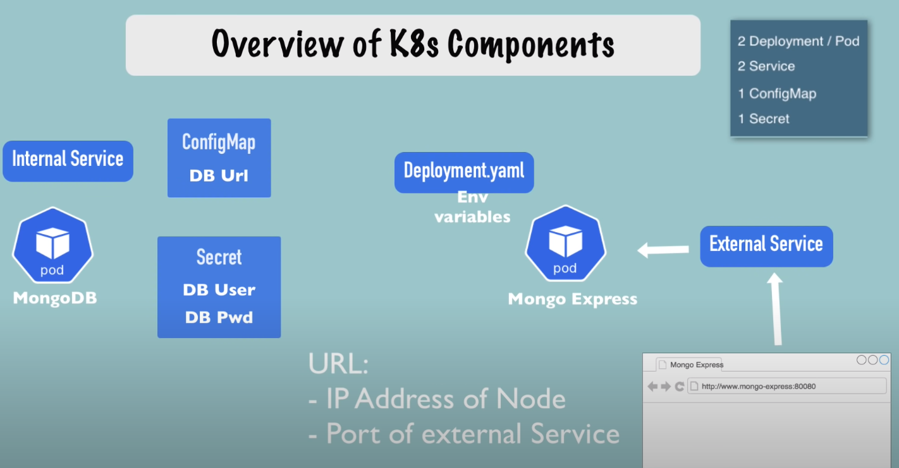
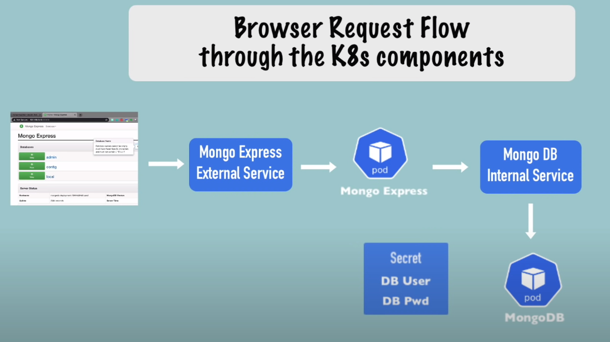

## Mongodb and mongo-express service maintained in kubernetes

This repository helps in setting up a mongodb database with mongo express as the GUI on Kubernetes.

How to use kubernetes in a local environment:

- **Minikube**: Installing using the link [here](https://minikube.sigs.k8s.io/docs/start/]).
- Install docker, kubectl, kubeadm and kubelet
  `$sudo apt install docker kubectl kubeadm kubelet`

The system architecture



Flow Design



1. How to run the project
   To run the project, open the terminal and run:

   ```
   $minikube start
   # adding username and password
   $kubectl apply -f secret.yml
   # adding database_url variable
   $kubectl apply -f configmap.yml
   # adds mongodb database deployment and service
   $kubectl apply -f mongodb-deployment.yaml
   # adds mongo-express
   $kubectl apply -f mongo-express-deployment.yml
   ```

2. File Descriptions

- secret.yml: it stores the sensitive variables for kubernetes. Kubernetes in secrets store the variables in base64 encoding.

  To convert your varibales into base64, you can use the terminal and run the command:

  `$echo -n variable | base64`

- configmap.yml: configmap is used to store common variable used top reference each places. It is always useful to apply secret and configmaps before dployment of kubernetes deployment files so that the variables can be referenced.
- mongodb-deplyoment.yml: It consists of the mongodb database.
- mongo-express-deployment.yml: consists of mong-express container and its service open on port 30000
